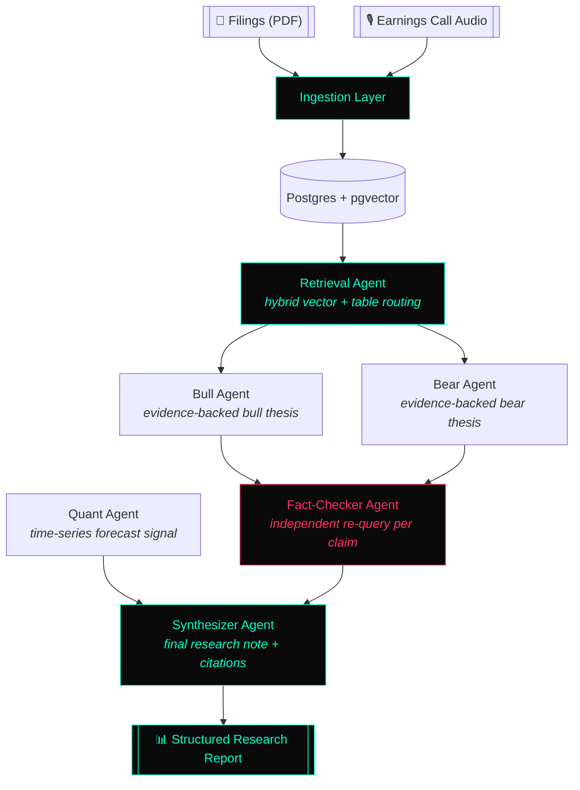

<div align="center">

# ⚡ CONSILIUM

### Multi-Agent LLM Research Engine for Automated Equity Analysis

*Deliberate. Cross-examine. Synthesize. Cite.*

[](https://www.python.org/)
[](https://fastapi.tiangolo.com/)
[](https://nextjs.org/)
[](https://langchain-ai.github.io/langgraph/)
[](https://www.postgresql.org/)
[](https://www.docker.com/)
[](#license)

<br/>

[]()
[]()
[]()

</div>

---

## `01` — Overview

**Consilium** *(Latin: a deliberative council)* is a production-patterned, multi-agent LLM system that automates equity research the way a real analyst desk would — not with a single model summarizing a document, but with a graph of specialized agents that **argue, cross-examine, and independently verify each other** before producing a sourced research note.

> Retail traders and junior analysts burn hours cross-referencing earnings-call commentary against filed financials before trusting a claim. Consilium compresses that workflow into a single auditable pipeline — every output is traceable back to a source PDF page, table cell, or transcript timestamp.

This is not a wrapper around a chat completion. It is a **stateful agentic system** with independent tool-using verification, structured schema contracts between nodes, and a CI-gated evaluation harness.

---

## `02` — System Architecture



**Design principle:** every edge in this graph carries a validated Pydantic schema, not a raw string. No agent output reaches another agent without passing structural validation first.

---

## `03` — Agent Graph Breakdown

| Node | Role | Agentic Behavior |
|---|---|---|
| `retrieval_agent` | Hybrid vector + structured-table routing | Decides retrieval strategy per query type |
| `bull_agent` | Constructs the strongest evidence-backed bullish thesis | Schema-constrained generation, citation-bound |
| `bear_agent` | Constructs the strongest evidence-backed bearish thesis | Schema-constrained generation, citation-bound |
| `fact_checker_agent` | **Independently re-queries retrieval per claim** and labels each `SUPPORTED` / `CONTRADICTED` / `UNVERIFIABLE` | Fully agentic — autonomous tool use, per-claim loop |
| `quant_agent` | Time-series forecast signal, explicit agreement/disagreement vs. qualitative thesis | Structured signal generation |
| `synthesizer_agent` | Aggregates all node outputs into a cited, structured research note | Deterministic aggregation |

---

## `04` — Tech Stack

<table>
<tr>
<td valign="top" width="33%">

**Backend**
- Python 3.11
- FastAPI (async)
- Pydantic v2
- SQLAlchemy 2.0 (async)
- LangGraph / LangChain

</td>
<td valign="top" width="33%">

**Data & Retrieval**
- PostgreSQL 16 + `pgvector`
- Hybrid vector + keyword search
- faster-whisper (ASR)
- Document / Table QA routing

</td>
<td valign="top" width="33%">

**Frontend & Ops**
- Next.js 15 (App Router)
- TypeScript + Tailwind
- Docker Compose
- RAGAS eval harness
- GitHub Actions CI eval-gate

</td>
</tr>
</table>

---

## `05` — Core Capabilities

- **Hybrid RAG** over unstructured filings and structured financial tables — routed, not flattened
- **Timestamped ASR pipeline** for earnings call audio with citation-grade traceability
- **Independent fact-checking layer** that re-verifies every claim against source documents rather than trusting upstream agents
- **Time-series forecasting signal** with explicit agreement/disagreement reasoning against the qualitative thesis
- **Full citation resolution** — every claim in the final report links back to a source chunk, table cell, or transcript timestamp
- **LLMOps eval gate** — RAGAS faithfulness/precision scoring + fact-checker accuracy validation, enforced in CI

---

## `06` — Quickstart

```bash
# clone
git clone https://github.com/sheshakanthra/CONSI-LIUM.git consilium
cd consilium

# environment
# The API needs an LLM key (LLM_PROVIDER / GROQ_API_KEY) for /research.
cp apps/api/.env.example apps/api/.env

# Only needed to run the web app OUTSIDE Docker (`pnpm dev`) — docker-compose
# already supplies NEXT_PUBLIC_API_BASE_URL to the web container.
cp apps/web/.env.example apps/web/.env.local

# boot the full stack
docker-compose up
```

Then open the dashboard, enter a ticker (`ACME` or `GLOBEX` for the bundled
synthetic filings), and click through any citation to see the source page or
table cell it resolves to.

> **First run:** the sample filings must be ingested and indexed before a ticker
> has any evidence — see [`docs/phase1-ingestion.md`](docs/phase1-ingestion.md)
> and [`docs/phase2-rag.md`](docs/phase2-rag.md). A ticker with no indexed
> filings returns a valid, empty note rather than an error.

| Service | URL |
|---|---|
| API health | `http://localhost:8000/health` |
| Web dashboard | `http://localhost:3000/dashboard` |
| Postgres | `localhost:5432` |

---

## `07` — Repository Structure

```
consilium/
├── apps/
│   ├── api/              # FastAPI service — ingestion, retrieval, agent graph
│   └── web/               # Next.js dashboard + trace viewer
├── packages/
│   └── shared-types/       # Cross-language schema parity
├── eval/
│   ├── golden_set/          # Hand-curated Q&A + fact-check eval pairs
│   └── scripts/             # RAGAS + fact-checker accuracy runners
├── infra/
│   └── postgres/init/       # pgvector bootstrap
├── docs/                  # Per-phase design-decision notes
└── docker-compose.yml
```

---

## `09` — Evaluation Methodology

Every retrieval and agent-reasoning claim is measured, not assumed:

- **RAGAS** — faithfulness, answer relevancy, context precision on a hand-curated golden set
- **Fact-checker accuracy** — precision/recall on deliberately true and false claim injections
- **CI eval-gate** — pull requests are blocked if faithfulness or fact-check accuracy regress below threshold

### Measured results

| Metric | Score | n |
|---|---|---|
| Golden answer accuracy (table + document QA) | **100%** | 24 |
| Refusal accuracy (unanswerable → refuse, no citation) | **100%** | 8 |
| Fact-checker accuracy (70B judge) | **100%** | 16 |
| RAGAS faithfulness | **0.93** | 24 |
| RAGAS answer relevancy | **0.85** | 24 |
| RAGAS context precision | **1.00** | 24 |

> **Read these honestly:** they are measured on a **two-document synthetic
> corpus**, so they're ceiling-heavy by construction. The harness's value is
> regression-detection and methodology, not a claim of broad real-world
> accuracy. Full caveats — including the 8B-vs-70B judge swap forced by the
> free-tier token cap — are in [`docs/phase5-eval.md`](docs/phase5-eval.md).

---


